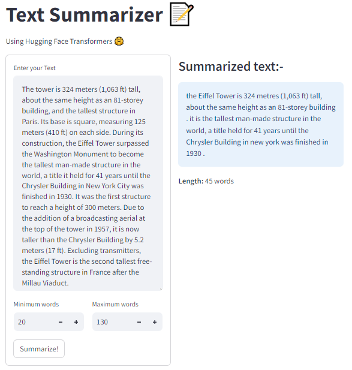

Welcome to the Text Summarizer app! This interactive tool allows you to quickly summarize your text using state-of-the-art natural language processing models from Hugging Face Transformers.

## How to Use:
1. Enter Your Text:

Use the text area provided to input the text you want to summarize. Feel free to paste or type your content.
2. Set Word Length Constraints:

Adjust the minimum and maximum word limits for the summary using the interactive sliders. Tailor the length of the summary to meet your requirements.
3. Summarize:

Click the "Summarize!" button to initiate the summarization process. The app uses Hugging Face's pre-trained summarization model to generate a concise summary of your input.
4. Review the Result:

The summarized text will be displayed in the second column. Additionally, you'll see the word count of the generated summary.

## Snapshots
